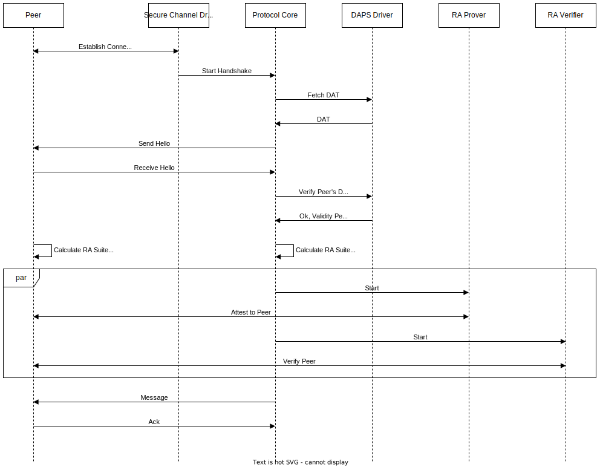

This document aims to give a short overview over the IDSCP2 protocol.

## Components

The IDSCP2 protocol can be divided into four components.
These are the core, secure channel, DAPS and remote attestation.
All but the core protocol are implemented using drivers.
While a number of default drivers are provided, custom drivers can be implemented as described
[here](wiki/IDSCP2-Driver-Development).

The following diagram shows the basics of how the four components interact.
Each connection between two components describes an interface that is provided by one and required by another component.

### Core

As its name suggests, the core is at the center of the protocol.
It defines the IDSCP2 message format and makes sure that no data is lost and messages are
delivered in order.

It is responsible for orchestrating the other components after being started by the secure channel
driver.
During the handshake, it obtains and verifies DATs using the DAPS driver, negotiates the Remote
Attestation suite with its peer and invokes the corresponding RA Drivers.
After a connection has been established, it is used to send and receive data and handle message
acknowledgments.
The protocol may also request new DATs and re-attestation from the peer as well as provide both to
the peer upon request.

The core protocol is implemented using a finite state machine that is documented in detail
[here](wiki/IDSCP2-Core).

### DAPS

The Dynamic Attribute Provisioning Service (DAPS) is a trusted entity within IDS that is
responsible for providing information about a peer using Dynamic Attribute Tokens (DATs).
Within IDSCP2, communication with the DAPS is handled by the DAPS Driver.
A DAPS Driver provides functionality to obtain and verify DATs.

The IDSCP2 repository provides the [AISEC DAPS Driver](wiki/AISEC-DAPS-Driver).
Custom DAPS Drivers can be created as described
[here](wiki/IDSCP2-Driver-Development#custom-daps-driver).

### Secure Channel

The secure channel is the underlying communication mechanism of the IDSCP2 connection.
It must protect data integrity and provide authenticity and confidentiality.
The Secure Channel Driver makes a secure channel implementation available to IDSCP2.

A Secure Channel Driver must provide both a server and client.
The Server implementation listens for incoming connections and invokes the IDSCP2 core after a
client has connected.
The client immediately starts the IDSCP2 core state machine after it has completed the secure
channel handshake.

The [provided Secure Channel Driver](wiki/TLS1.3-Secure-Channel-Driver) provides an interface to
TLS 1.3.
Drivers for other channel types can be implemented as described
[here](wiki/IDSCP2-Driver-Development#custom-secure-channel).

### Remote Attestation

After the secure channel is established and initial hello messages are exchanged, remote
attestation is performed.
Which remote attestation method is used is negotiated in the initial hello messages.
In IDSCP2, remote attestation is performed using RA Drivers, which are split into Provers and
Verifiers.

The attesting peer spawns a RA Verifier, which makes sure, that the other peer is in a trustworthy
state.
The attested peer is running the corresponding RA Prover, which has to provide verifiable
information about its own state to the Verifier.
Since IDSCP2 uses mutual attestation, both peers need to act as a RA Prover and Verifier
concurrently.
The peers don't need to use the same attestation method.

The Prover and Verifier communicate over a custom and implementation defined protocol, which
is embedded into IDSCP2 messages.

Implementations of remote attestation drivers can be found in
[this repository](https://github.com/industrial-data-space/idscp2-rat-drivers/tree/develop).
Information about developing a custom driver can be found
[here](wiki/IDSCP2-Driver-Development#custom-ra-driver).

## Handshake

The following diagram describes the message flow of an IDSCP2 handshake to the point where data is
exchanged.
Communication between the DAPS driver and DAPS is omitted as it is implementation defined.
The message flow of the Secure Channel and RA drivers are simplified for the same reason.

This diagram does also not show DAT timeout, which can occur at any point after the hello messages
are exchanged.
For more information, consult the [core documentation](wiki/IDSCP2-Core)

